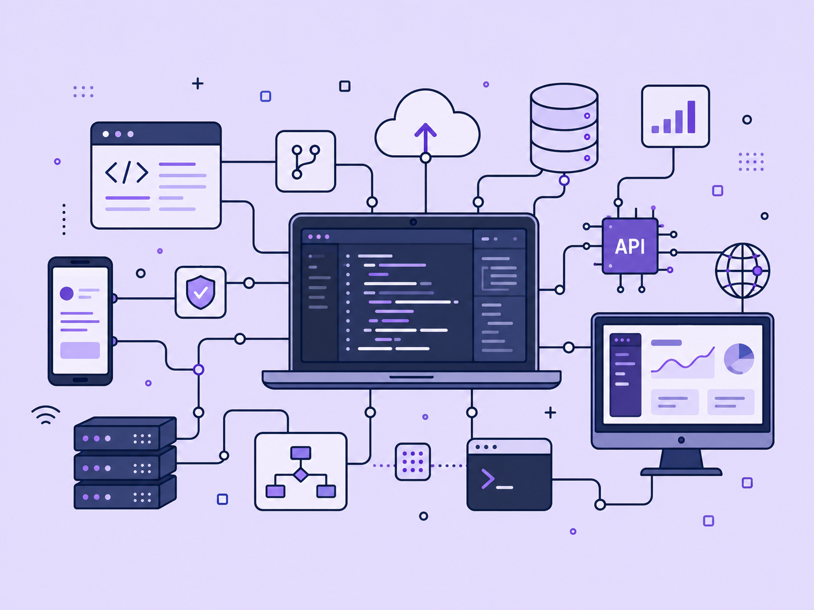

  🔴 🟡 🟢

  

<h1 align="center">Hola 👋, soy Abril Zapata</h1>

<h3 align="center">

<h3 align="center">Estudiante de Ingeniería Industrial | SAP</h3>

</h3>

<table>
  <tr>
    <td width="56%" align="center" valign="middle">
      

        🌱 Actualmente estoy fortaleciendo mis conocimientos en 
        <strong>Python</strong> y desarrollo de aplicaciones.
      

      

        👩‍🎓 Soy estudiante de <strong>Ingeniería Industrial</strong>.
     

  💼 Me desempeño como <strong>Analista de RRHH (SAP)</strong>.

        📊 Me interesa conectar <strong>procesos, datos y tecnología</strong>.
      

      

        🚀 Desarrollo proyectos orientados a mejorar 
        mi perfil técnico y funcional.
      

      

        🌐 Podés conocer mis proyectos en mi 
        <a href="https://abrilzapata-portfolio.netlify.app/"><strong>portfolio profesional</strong></a>.
      

    </td>
   <td width="44%" valign="middle" align="center">
  
    
  <strong>Procesos + Tecnología + Personas</strong>
</td>

  </tr>
</table>

 

 

## 📚 Actualmente aprendiendo

- Automatizaciones
- Desarrollo de interfaces gráficas
- Power BI y visualización de datos
- SAP HCM
- Aplicaciones orientadas al usuario

 

## 🛠️ Tecnologías y herramientas

### Lenguajes y desarrollo web

  
  
  

### Datos, procesos y sistemas

  
  
  

### Herramientas y tecnologías en desarrollo

  
  
  
  

 

## 📫 Contacto

  
  

